# Cursor 运行时注入流程图

```mermaid
flowchart TD
    subgraph PreCheck["预检查阶段"]
        A["handleDeploy<br/>CursorPanel:245"] --> B{"activeId 已设置且<br/>引擎 API 密钥存在？"}
        B -->|否| C["显示 EngineWarningModal<br/>CursorPanel:355"]
        C --> D{"用户点击继续<br/>EngineWarningModal:361"}
        D -->|否| STOP["中止部署"]
        D -->|是| E
        B -->|是| E{"hasBackup == false 且<br/>versionMismatch == false？<br/>CursorPanel:252"}
        E -->|是| F["显示 BackupConfirmModal<br/>CursorPanel:372"]
        F --> G["onConfirmBackupAndDeploy<br/>CursorPanel:278"]
        G --> H["IPC cursor:createBackup<br/>CursorPanel:282"]
        E -->|否| I["executeDeploy<br/>CursorPanel:256 | 103"]
        H --> I
    end

    subgraph ConfigPersist["配置持久化阶段"]
        I --> J["saveConfig()<br/>CursorPanel:208"]
        J --> K["IPC config:save<br/>main.js:406"]
        K --> L["fs.writeFileSync(CONFIG_FILE_PATH)<br/>main.js:409"]
    end

    subgraph DictCheck["字典检查阶段"]
        L --> M["IPC dict:status({app:'cursor', lang})<br/>CursorPanel:123"]
        M --> N["main.js:451 检查字典路径<br/>(~/.live_translator_hub/dicts/cursor/)"]
        N --> O{"dictInfo.exists？<br/>CursorPanel:125"}
        O -->|"是（非 fallback）"| P["步骤 dict-extract 和<br/>dict-translate：跳过<br/>CursorPanel:188-189"]
        O -->|"否或 fallback"| Q{"是否配置了<br/>AI 引擎？<br/>CursorPanel:127"}
        Q -->|否| R{"是否有 fallback<br/>字典可用？"}
        R -->|是| S["警告：使用内置字典<br/>CursorPanel:130"]
        R -->|否| T["警告：仅运行时翻译<br/>CursorPanel:132"]
        Q -->|是| U["IPC dict:generate({app,lang,engine})<br/>CursorPanel:170"]
    end

    subgraph DictGenerate["字典生成（子流程）"]
        U --> V["main.js:430 new DictGenerator(engineConfig)"]
        V --> W["DictGenerator.generate('cursor')<br/>dict-generator/index.js:35"]
        W --> X["CursorExtractor：从 Cursor ASAR<br/>中提取源字符串"]
        X --> Y["通过适配器进行 AI 批量翻译<br/>(openai/anthropic/gemini/deepl)"]
        Y --> Z["原子写入 dictionary.{lang}.json<br/>(~/.live_translator_hub/dicts/cursor/)"]
        Z --> AA["通过 IPC 发送进度事件<br/>dict:progress main.js:441"]
    end

    subgraph DeployPreBackup["备份阶段"]
        P --> AB
        S --> AB
        T --> AB
        AA --> AB{"status.hasBackup？<br/>CursorPanel:211"}
        AB -->|是| AC["备份步骤：跳过<br/>CursorPanel:212"]
        AB -->|否| AD["IPC cursor:createBackup<br/>CursorPanel:216"]
        AD --> AE["CursorPatcher.createBackup<br/>patcher-cursor/index.js:169"]
        AE --> AF["fs.copyFileSync(workbench.js .bak)<br/>patcher-cursor:190"]
        AF --> AG["fs.copyFileSync(workbench.html .bak)<br/>patcher-cursor:193"]
    end

    subgraph InjectPhase["注入/补丁阶段"]
        AC --> AH
        AG --> AH["IPC i18n:installCursor(config)<br/>CursorPanel:226"]
        AH --> AI["main.js:336 loadApiKeys +<br/>cursor.install(config, hooks)"]
        AI --> AJ["CursorPatcher.install<br/>patcher-cursor/index.js:219"]
        AJ --> AK["detectStatus 验证路径<br/>patcher-cursor:220"]
        AK --> AL["fs.readFileSync(workbench.js)<br/>patcher-cursor:231"]
        AL --> AM["解析 translator-engine.js<br/>patcher-cursor:246"]
        AM --> AN["loadI18n(targetLang) 读取字典 JSON<br/>patcher-cursor:273"]
        AN --> AO["构建 injectCode = engine + dict + config<br/>patcher-cursor:274"]
        AO --> AP["fs.appendFileSync(workbench.js, injectCode)<br/>patcher-cursor:283"]
        AP --> AQ["放宽 workbench.html 中的 CSP<br/>patcher-cursor:288"]
        AQ --> AR["注入 webview 插件<br/>patcher-cursor:301-356"]
        AR --> AS["更新 product.json SHA-256 校验和<br/>patcher-cursor:361-366"]
        AS --> AT{"平台是 darwin？<br/>patcher-cursor:368"}
        AT -->|是| AU["xattr -cr + codesign --force --deep --sign -<br/>patcher-cursor:373-374"]
        AT -->|否| AV["（跳过签名）"]
    end

    subgraph Finalize["收尾"]
        AU --> AW
        AV --> AW["refreshStatus() + fetchExtensions()<br/>CursorPanel:229-230"]
        AW --> AX["DeployProgressModal：全部成功<br/>CursorPanel:379"]
    end

    style STOP fill:#f55,color:#fff
```

## 外部依赖

| 依赖 | 文件:行号 | 用途 |
|---|---|---|
| `@live-translator/dict-generator` | `main.js:432` | 字典生成引擎 |
| `@live-translator/core/translator-engine.js` | `patcher-cursor/index.js:246` | 注入到 Cursor 中的运行时内核 |
| `@live-translator/core/language-names` | `patcher-cursor/index.js:255` | 语言代码名称映射 |
| `~/.live_translator_hub/config.json` | `main.js:26-33` | 应用配置持久化 |
| `~/.live_translator_hub/api_keys.enc` | `main.js:46-59` | 加密的 API 密钥（safeStorage） |
| `~/.live_translator_hub/dicts/cursor/` | `main.js:466-478` | 字典输出目录 |
| `child_process.execSync` | `patcher-cursor/index.js:370-374` | macOS xattr + 代码签名 |
| `crypto.createHash('sha256')` | `patcher-cursor/index.js:361-362` | product.json 校验和 |
| `electron.safeStorage` | `main.js:36-58` | 操作系统级 API 密钥加密 |
