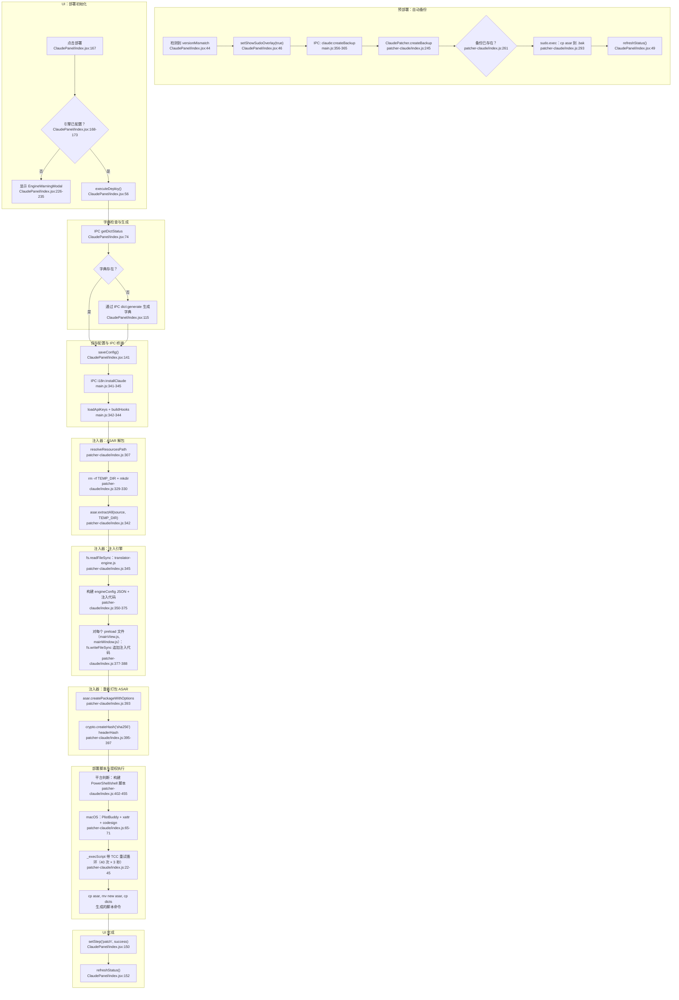

# Claude 运行时注入流程图

## 外部依赖

| 依赖 | 文件:行号 | 用途 |
|---|---|---|
| `@electron/asar` | `patcher-claude/index.js:342,393` | ASAR 解包与重新打包 |
| `sudo-prompt` | `patcher-claude/index.js:293` | 仅用于备份的提权 cp |
| `@live-translator/core/translator-engine.js` | `patcher-claude/index.js:345` | 运行时内核 |
| `@live-translator/core/language-names` | `patcher-claude/index.js:349` | 语言代码映射 |
| macOS PlistBuddy | `patcher-claude/index.js:67-68` | 更新 Info.plist 哈希 |
| macOS xattr | `patcher-claude/index.js:69-70` | 移除隔离属性 |
| macOS codesign | `patcher-claude/index.js:71` | 重新签名 .app 包 |
| `crypto.createHash` | `patcher-claude/index.js:397` | ASAR 头部 SHA-256 |
| `child_process.execSync` | `patcher-claude/index.js:22` | 提权脚本执行 |
| `shell.openExternal` | `main.js:333` | 打开 macOS TCC 偏好设置 |
