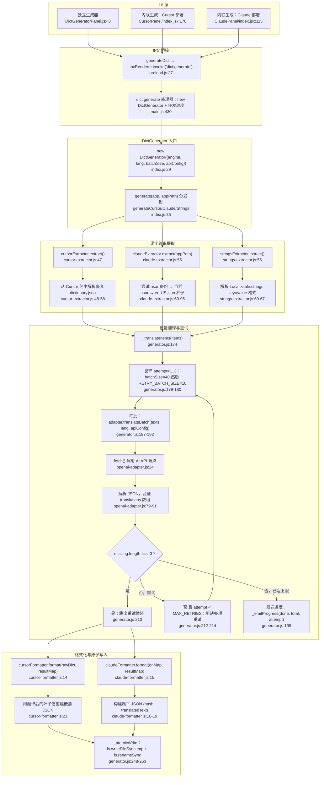

# 字典生成流程图

## 外部依赖

| 依赖 | 文件:行号 | 用途 |
|---|---|---|
| `@live-translator/patcher-cursor` | `cursor-extractor.js:11` | Cursor dictionary.json 路径 |
| `@live-translator/patcher-claude` | `claude-extractor.js:17` | Claude 应用资源路径与版本 |
| `@electron/asar` | `claude-extractor.js:32` | 从 app.asar 提取文件 |
| `openai-adapter.js` | `generator.js:21` | OpenAI 兼容的批量翻译 |
| `anthropic-adapter.js` | `generator.js:22` | Anthropic 批量翻译 |
| `gemini-adapter.js` | `generator.js:23` | Gemini 批量翻译 |
| `deepl-adapter.js` | `generator.js:24` | DeepL 批量翻译 |
| `cursor-formatter.js` | `generator.js:32` | 嵌套 JSON 输出 |
| `claude-formatter.js` | `generator.js:33` | 扁平 hash-JSON 输出 |
| `strings-formatter.js` | `generator.js:34` | Apple .strings 输出 |
