# API 密钥管理流程图

```mermaid
flowchart TD
  subgraph SaveFlow["保存流程"]
    A1["用户点击保存<br/>ApiKeysPanel.jsx:131"]
    A2["handleSave() → updateApiKeys(keys)<br/>configStore.js:175"]
    A3["IPC config:saveApiKeys<br/>preload.js:22"]
    A4["safeStorage.encryptString + fs.writeFileSync<br/>main.js:42-43"]
    A5["降级方案：fs.writeFileSync 明文写入<br/>main.js:39"]
    A6["返回 {ok:true}<br/>configStore.js:180"]
  end

  subgraph LoadFlow["加载流程"]
    B1["应用启动：loadConfig()<br/>configStore.js:86"]
    B2["IPC config:loadApiKeys<br/>preload.js:23"]
    B3["safeStorage.decryptString → JSON.parse<br/>main.js:50-51"]
    B4["降级方案：读取明文文件<br/>main.js:55"]
    B5["合并到 Zustand config.apiKeys<br/>configStore.js:98"]
  end

  subgraph TestFlow["测试连接流程"]
    C1["用户点击测试<br/>ApiKeysPanel.jsx:199"]
    C2["IPC config:testApiKey<br/>preload.js:24"]
    C3["DictGenerator.testConnection({engine, apiKey, model, baseURL})<br/>main.js:423"]
    C4["adapter.testConnection → fetch 调用 AI API<br/>dict-generator/index.js:53-55"]
    C5["返回 {ok:true} 或 {ok:false, error}<br/>main.js:424-426"]
  end

  subgraph DeployFlow["部署注入"]
    D1["IPC i18n:installCursor/Claude<br/>main.js:336/341"]
    D2["loadApiKeys() → config.engines = apiConfig.engines<br/>main.js:337-338"]
    D3["patcher.install(config, hooks)<br/>main.js:339/344"]
  end

  A1 --> A2 --> A3 --> A4 --> A6
  A4 -.->|无加密| A5 --> A6
  B1 --> B2 --> B3 --> B5
  B2 -.->|明文降级| B4 --> B5
  C1 --> C2 --> C3 --> C4 --> C5
  D1 --> D2 --> D3
```

## 外部依赖

| 依赖 | 文件:行号 | 用途 |
|---|---|---|
| `electron.safeStorage.encryptString` | `main.js:42` | 加密 API 密钥 |
| `electron.safeStorage.decryptString` | `main.js:51` | 解密 API 密钥 |
| `fs.writeFileSync` | `main.js:39,43` | 将密钥写入磁盘（权限 0o600） |
| `DictGenerator.testConnection` | `main.js:423` | 测试适配器连接 |
| `api-adapters/openai-adapter.js:24` | fetch 调用外部 API | OpenAI 连接测试 |
