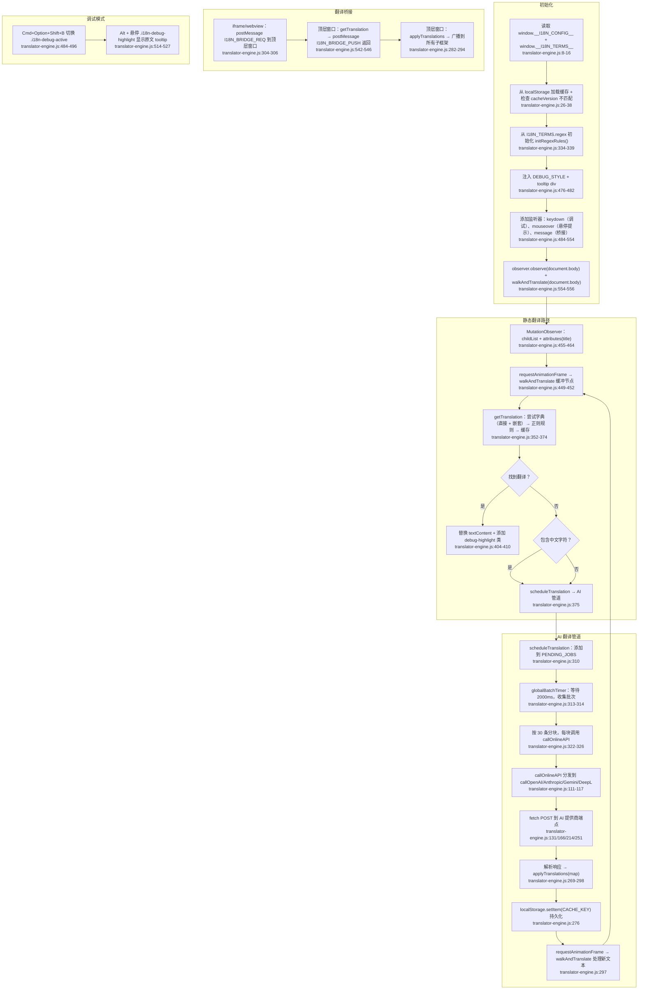

# 翻译运行时内核流程图

## 可配置常量

| 常量 | 行号 | 值 | 描述 |
|---|---|---|---|
| `REQUEST_INTERVAL` | 68 | 2000ms | 收集批次前的防抖时间 |
| `chunkSize` | 322 | 30 | 每次 API 调用的文本数 |
| `HAS_CHINESE` | 109 | `/[一-龥]/` | 中文字符检测正则 |
| `SKIP_TAGS` | 18 | SCRIPT, STYLE, TEXTAREA 等 | 永不翻译的 HTML 标签 |
| 缓存限制 | 46 | 5120 KB | 仅警告阈值（不驱逐） |
| OpenAI `model` | 138 | `gpt-4o-mini` | 默认模型 |
| OpenAI `temperature` | 142 | 0.3 | 补全随机性 |
| OpenAI `max_tokens` | 141 | 4096 | 响应 token 限制 |
| Anthropic `model` | 174 | `claude-sonnet-4-6` | 默认模型 |
| Gemini `model` | 211 | `gemini-2.0-flash` | 默认模型 |
| Gemini `temperature` | 219 | 0.1 | 生成温度 |
| `enableDictionary` | 11 | true | 静态字典查找 |
| `enableNestedDict` | 12 | true | 递归字典搜索 |
| `enableRegex` | 13 | true | 正则模式规则 |
| `enableTranslationBridge` | 14 | true | iframe↔top postMessage 桥接 |
| `enableLoadingAnimation` | 15 | true | 待翻译文本的 CSS 加载动画 |
