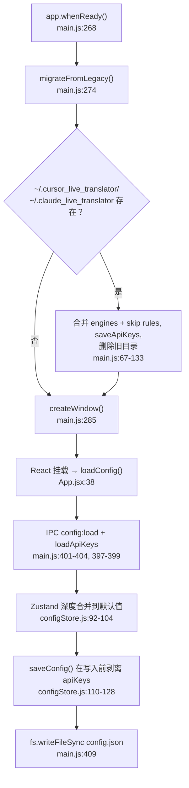
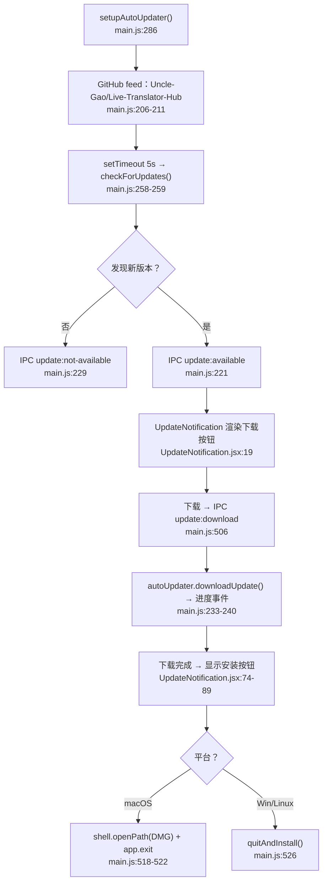
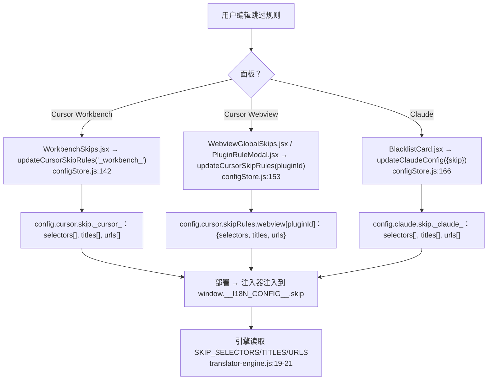
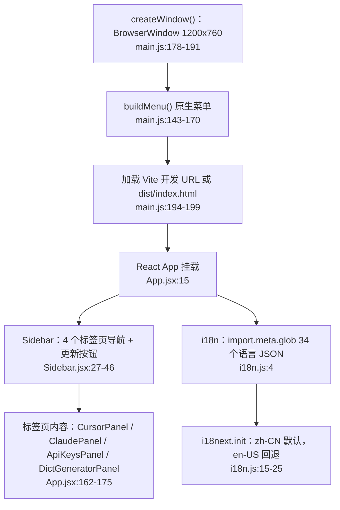

# 配置、自动更新、跳过规则、应用外壳流程图

## A. 配置持久化与迁移

```mermaid
flowchart TD
    A["app.whenReady()<br/>main.js:268"] --> B["migrateFromLegacy()<br/>main.js:274"]
    B --> C{"~/.cursor_live_translator/<br/>~/.claude_live_translator 存在？"}
    C -->|是| D["合并 engines + skip rules, saveApiKeys,<br/>删除旧目录<br/>main.js:67-133"]
    C -->|否| E
    D --> E["createWindow()<br/>main.js:285"]
    E --> F["React 挂载 → loadConfig()<br/>App.jsx:38"]
    F --> G["IPC config:load + loadApiKeys<br/>main.js:401-404, 397-399"]
    G --> H["Zustand 深度合并到默认值<br/>configStore.js:92-104"]
    H --> I["saveConfig() 在写入前剥离 apiKeys<br/>configStore.js:110-128"]
    I --> J["fs.writeFileSync config.json<br/>main.js:409"]
```

## B. 自动更新

```mermaid
flowchart TD
    A["setupAutoUpdater()<br/>main.js:286"]
    A --> B["GitHub feed：Uncle-Gao/Live-Translator-Hub<br/>main.js:206-211"]
    B --> C["setTimeout 5s → checkForUpdates()<br/>main.js:258-259"]
    C --> D{"发现新版本？"}
    D -->|否| E["IPC update:not-available<br/>main.js:229"]
    D -->|是| F["IPC update:available<br/>main.js:221"]
    F --> G["UpdateNotification 渲染下载按钮<br/>UpdateNotification.jsx:19"]
    G --> H["下载 → IPC update:download<br/>main.js:506"]
    H --> I["autoUpdater.downloadUpdate() → 进度事件<br/>main.js:233-240"]
    I --> J["下载完成 → 显示安装按钮<br/>UpdateNotification.jsx:74-89"]
    J --> K{"平台？"}
    K -->|macOS| L["shell.openPath(DMG) + app.exit<br/>main.js:518-522"]
    K -->|Win/Linux| M["quitAndInstall()<br/>main.js:526"]
```

## C. 跳过规则配置

```mermaid
flowchart TD
    A["用户编辑跳过规则"] --> B{"面板？"}
    B -->|Cursor Workbench| C["WorkbenchSkips.jsx → updateCursorSkipRules('_workbench_')<br/>configStore.js:142"]
    B -->|Cursor Webview| D["WebviewGlobalSkips.jsx / PluginRuleModal.jsx → updateCursorSkipRules(pluginId)<br/>configStore.js:153"]
    B -->|Claude| E["BlacklistCard.jsx → updateClaudeConfig({skip})<br/>configStore.js:166"]
    C --> F["config.cursor.skip._cursor_：selectors[], titles[], urls[]"]
    D --> G["config.cursor.skipRules.webview[pluginId]：{selectors, titles, urls}"]
    E --> H["config.claude.skip._claude_：selectors[], titles[], urls[]"]
    F --> I["部署 → 注入器注入到 window.__I18N_CONFIG__.skip"]
    G --> I
    H --> I
    I --> J["引擎读取 SKIP_SELECTORS/TITLES/URLS<br/>translator-engine.js:19-21"]
```

## D. 桌面应用外壳与 i18n

```mermaid
flowchart TD
    A["createWindow()：BrowserWindow 1200x760<br/>main.js:178-191"]
    A --> B["buildMenu() 原生菜单<br/>main.js:143-170"]
    B --> C["加载 Vite 开发 URL 或 dist/index.html<br/>main.js:194-199"]
    C --> D["React App 挂载<br/>App.jsx:15"]
    D --> E["Sidebar：4 个标签页导航 + 更新按钮<br/>Sidebar.jsx:27-46"]
    D --> F["i18n：import.meta.glob 34 个语言 JSON<br/>i18n.js:4"]
    F --> G["i18next.init：zh-CN 默认，en-US 回退<br/>i18n.js:15-25"]
    E --> H["标签页内容：CursorPanel / ClaudePanel / ApiKeysPanel / DictGeneratorPanel<br/>App.jsx:162-175"]
```
