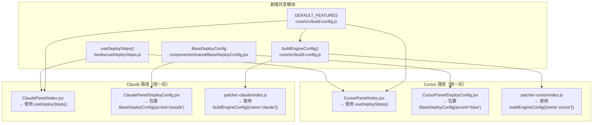

# 统一架构方案

## 原则：简化，而非抽象

以下每个方案都遵循一条规则：消除重复，不增加间接层。不为"灵活性"而添加新的抽象。每次统一都减少需要修改的地方数量。

---

## 方案 1：提取 `useDeploySteps()` Hook

**问题：** `setStep`、`appendLog`、`PROGRESS_RE`、`hasErrorInSteps`、`allDone` 以及部署弹窗状态在 `CursorPanel/index.jsx` 和 `ClaudePanel/index.jsx` 之间逐字复制粘贴。

**解决方案：** 提取为共享 hook：

```js
// 新文件：packages/desktop-app/src/hooks/useDeploySteps.js
function useDeploySteps(createSteps) {
  const [steps, setSteps] = useState(createSteps());
  const [showDeployModal, setShowDeployModal] = useState(false);
  // ... setStep, appendLog, hasErrorInSteps, allDone
  return { steps, setSteps, showDeployModal, setShowDeployModal, setStep, appendLog, hasErrorInSteps, allDone };
}
```

**旧调用点变为：**
- `CursorPanel/index.jsx:66-78` → `const { steps, ... } = useDeploySteps(createCursorSteps)`
- `ClaudePanel/index.jsx:28-40` → `const { steps, ... } = useDeploySteps(createClaudeSteps)`

**功能损失：** 无。完全相同的行为。

---

## 方案 2：将 Fallback 字典处理移植到 ClaudePanel

**问题：** CursorPanel 处理"fallback 字典"（在未配置 AI 引擎时可以使用的内置字典）。ClaudePanel 从未更新此逻辑。

**解决方案：** 将 fallback 检查从 `CursorPanel/index.jsx:125-136` 移植到 ClaudePanel 的字典检查部分。`needGenerate = !dictInfo?.exists || dictInfo?.fallback` 逻辑与具体应用无关。

**旧调用点：** `ClaudePanel/index.jsx:76` — `if (dictInfo?.exists)`
**新调用点：** `const needGenerate = !dictInfo?.exists || dictInfo?.fallback`（与 CursorPanel 相同）

**功能损失：** 无。增加缺失的功能对等。

---

## 方案 3：提取 `buildEngineConfig()` 共享函数

**问题：** 两个注入器构建完全相同的 `engineConfig` 对象（9 个相同字段）。唯一区别是 `skip` 字段结构和 name 字段。

**解决方案：** 将公共核心提取为共享函数：

```js
// 新文件：packages/core/src/build-config.js
function buildEngineConfig(config, { name, skipSelectors, skipTitles, skipUrls }) {
  return {
    name,
    apiType: config.apiType,
    engineId: config.activeId,
    targetLanguage: languageName(config.targetLanguage),
    targetLanguageCode: languageCode(config.targetLanguage),
    openai: config.apiType === 'openai' ? activeEngine : null,
    anthropic: config.apiType === 'anthropic' ? activeEngine : null,
    gemini: config.apiType === 'gemini' ? activeEngine : null,
    deepl: config.apiType === 'deepl' ? activeEngine : null,
    skip: { selectors: skipSelectors, titles: skipTitles, urls: skipUrls },
    cacheVersion: config.cacheVersion || 0,
    features: Object.assign({}, DEFAULT_FEATURES, config.features || {})
  };
}
```

**旧调用点变为：**
- `patcher-cursor/index.js:260-272` → `buildEngineConfig(config, { name: 'cursor', skipSelectors, ... })`
- `patcher-claude/index.js:350-372` → `buildEngineConfig(config, { name: 'claude', skipSelectors, ... })`

**功能损失：** 无。`skip` 字段的差异通过参数化处理。

---

## 方案 4：提取 `BaseDeployConfig` 组件

**问题：** 两个 DeployConfig 文件共享约 70% 的 JSX（语言选择器、引擎选择器、缓存重置复选框、4 个功能开关、高级切换按钮）。仅在强调色和 Cursor 特有的插件控件上不同。

**解决方案：** 提取共享核心：

```jsx
// 新文件：packages/desktop-app/src/components/shared/BaseDeployConfig.jsx
function BaseDeployConfig({ config, updateConfig, accent, extraToggles, extraAdvanced }) {
  return (
    <div className="bg-[#1A1C1E] border border-white/5 rounded-3xl p-6 space-y-6">
      {/* 语言选择器（强调色应用于焦点环） */}
      {/* 引擎选择器 */}
      {/* 加载动画开关 */}
      {extraToggles}
      <AdvancedToggle>
        {/* 缓存重置复选框 */}
        {/* enableDictionary 复选框 */}
        {/* enableRegex、enableNestedDict、enableTranslationBridge 开关 */}
        {extraAdvanced}
      </AdvancedToggle>
    </div>
  );
}
```

**旧调用点变为：**
- CursorPanel 的 DeployConfig → `<BaseDeployConfig accent="blue" extraToggles={<InjectWebviewToggle ... />} extraAdvanced={...} />`
- ClaudePanel 的 DeployConfig → `<BaseDeployConfig accent="purple" />`

**功能损失：** 无。Cursor 保留插件选择器；Claude 保持简洁。

---

## 方案 5：定义 `DEFAULT_FEATURES` 常量

**问题：** 相同的 5 个功能开关及默认值出现在 4 个位置。

**解决方案：** 定义一次：

```js
// 在 packages/core/src/build-config.js（新文件）中
const DEFAULT_FEATURES = {
  enableDictionary: true,
  enableNestedDict: true,
  enableRegex: true,
  enableTranslationBridge: true,
  enableLoadingAnimation: true
};
```

**引用此常量的旧位置：**
- `configStore.js:9-15, 47-53` → 引用 `DEFAULT_FEATURES`
- `patcher-cursor/index.js:271` → 引用 `DEFAULT_FEATURES`
- `patcher-claude/index.js:365-371` → 引用 `DEFAULT_FEATURES`

**功能损失：** 无。相同的默认值，单一事实来源。

---

## 合并后的架构



## 我们不碰的部分

- **API 适配器**（4 个文件）— 合理的专业化，不同的网络协议
- **源字符串提取器**（3 个文件）— 从不同应用包中读取不同的文件格式
- **格式化器**（3 个文件）— 输出不同格式（嵌套 JSON、扁平 JSON、.strings）
- **ASAR vs 原始文件注入** — 根本不同的机制；Cursor 修改扁平文件，Claude 解包/重新打包 ASAR 归档
- **备份模型** — Cursor 使用版本化文件副本，Claude 使用 sudo-prompt ASAR 副本；两者都适合各自的平台

## 影响总结

| 方案 | 移除文件 | 节省行数 | 风险 |
|---|---|---|---|
| useDeploySteps | 0（新增文件） | ~80 行重复代码 | 低——纯提取 |
| Fallback 移植 | 0 | 新增 ~10 行 | 低——增加功能对等 |
| buildEngineConfig | 0（新增文件） | ~24 行重复代码 | 低——纯提取 |
| BaseDeployConfig | 0（新增文件） | ~80 行重复代码 | 中——组件提取 |
| DEFAULT_FEATURES | 0 | 0（但 4→1 个事实来源） | 低——常量定义 |
| **总计** | **+4 个新文件** | **~180 行去重** | |
