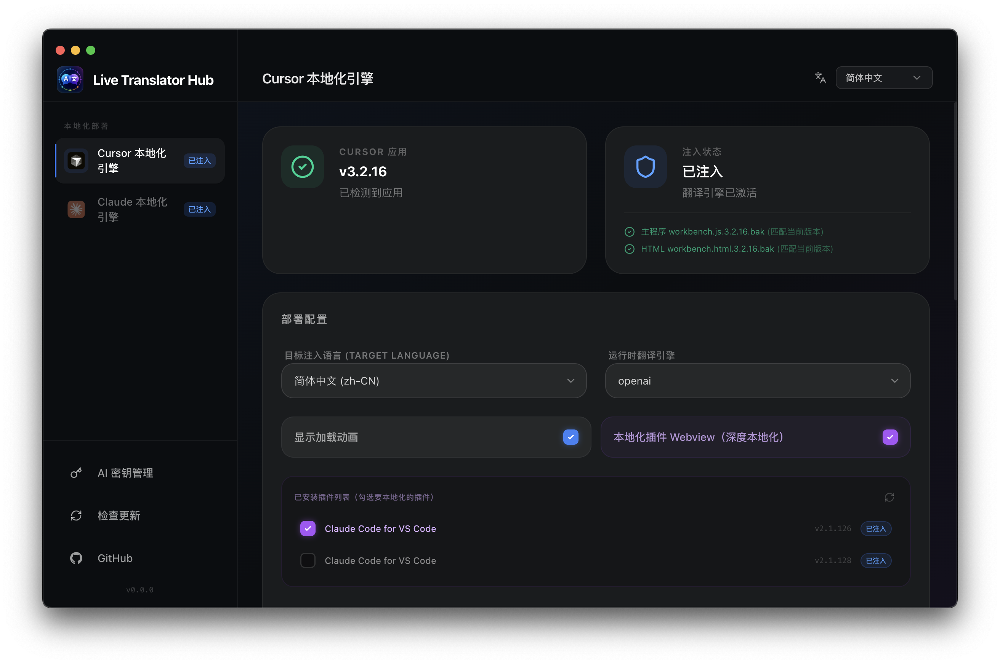
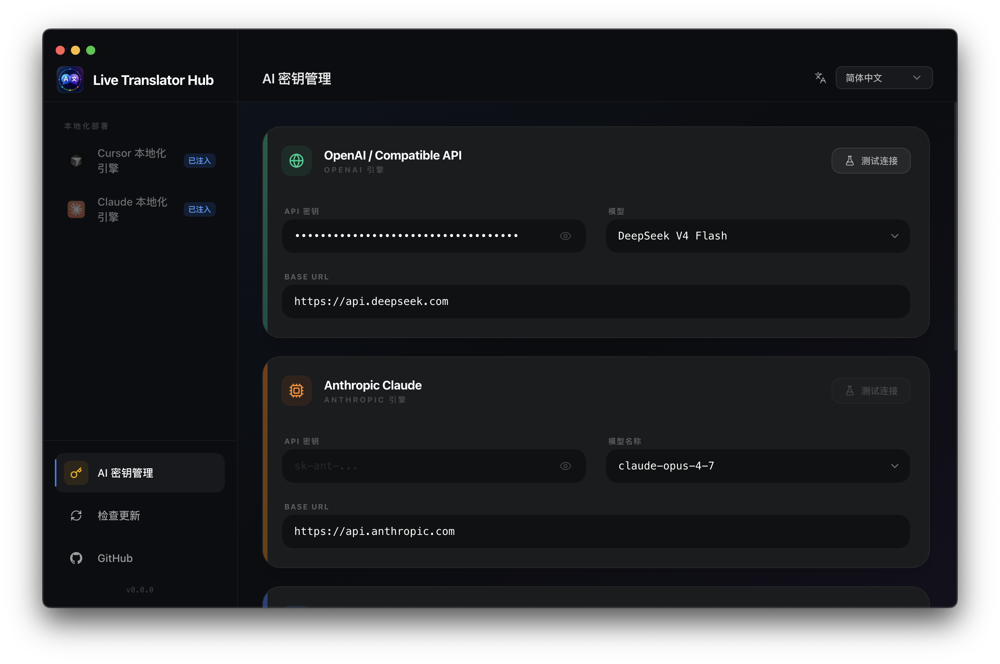

# Live Translator Hub

> Eine GUI-gestützte Echtzeit-Lokalisierungs-Engine für Cursor- und Claude-Desktop-Apps — mit Webview-Plug-in-Durchdringung und KI-gestützter asynchroner Übersetzung.

[English](../../README.md) | [日本語](ja-JP.md) | [한국어](ko-KR.md) | [Français](fr-FR.md) | [Español](es-ES.md) | [Italiano](it-IT.md) | [Português](pt-BR.md) | [Português](pt-PT.md) | [Nederlands](nl-NL.md) | [Polski](pl-PL.md) | [Svenska](sv-SE.md) | [Dansk](da-DK.md) | [Suomi](fi-FI.md) | [Norsk](nb-NO.md) | [Čeština](cs-CZ.md) | [Slovenčina](sk-SK.md) | [Română](ro-RO.md) | [Magyar](hu-HU.md) | [Ελληνικά](el-GR.md) | [Български](bg-BG.md) | [Українська](uk-UA.md) | [Русский](ru-RU.md) | [Lietuvių](lt-LT.md) | [Latviešu](lv-LV.md) | [Eesti](et-EE.md) | [Türkçe](tr-TR.md) | [Tiếng Việt](vi-VN.md) | [ไทย](th-TH.md) | [Bahasa Indonesia](id-ID.md) | [Bahasa Melayu](ms-MY.md) | [हिन्दी](hi-IN.md) | [中文](zh-CN.md)

## Projektübersicht

Live Translator Hub ist eine **Electron + React GUI Desktop-Anwendung**, die eine Ein-Klick-Lokalisierung für die beiden KI-Programmiertools Cursor und Claude bietet. Über einen einheitlichen Übersetzungs-Laufzeitkern werden die Engine-Bereitstellung, API-Schlüsselkonfiguration und Wörterbuchgenerierung für beide Zielanwendungen in einer Oberfläche verwaltet.

Dieses Projekt ist die architektonische Weiterentwicklung von [Live-Translator-Hub](https://github.com/Uncle-Gao/Live-Translator-Hub) – von einem CLI-Skript zu einer GUI mit Statuspanel und Echtzeitprotokollierung, die die Lokalisierungsfähigkeiten von Cursor und Claude in einer einzigen, einheitlichen Plattform vereint.




## Architektur

```
live-translator-ecosystem/          # npm workspaces monorepo
├── packages/
│   ├── desktop-app/                # Electron + React GUI (Live Translator Hub)
│   │   ├── electron/main.js        # Hauptprozess, IPC-Kanäle und Konfigurationspersistenz
│   │   ├── electron/preload.js     # Kommunikationsbrücke zum Renderer-Prozess
│   │   └── src/                    # React 19 + Tailwind v4 + Zustand
│   ├── core/                       # Übersetzungs-Laufzeitkern (translator-engine.js)
│   ├── patcher-cursor/             # Patcher für die Cursor-Anwendung
│   ├── patcher-claude/             # Patcher für die Claude-Anwendung
│   └── dict-generator/             # KI-Wörterbuchgenerator
```

### Übersetzungs-Laufzeit

`packages/core/src/translator-engine.js` ist die einzige Laufzeit, die in die Zielanwendungen injiziert wird – reines Browser-JS, keine Modulabhängigkeiten. Zu den Aufgaben gehören:

- **Wörterbuchabgleich**: Statische Einträge + Regex-Muster
- **KI-Übersetzungs-Proxy-Brücke**: In der Webview-Umgebung werden Übersetzungsanfragen über `postMessage` an das Hauptfenster weitergeleitet, um CSP-bedingte Netzwerkbeschränkungen zu umgehen
- **Übersetzungs-Cache**: Persistenter Cache basierend auf `localStorage`, Schlüsselname `live_i18n_cache_<entity_name>`
- **Verschachtelte Wörterbuchsuche**: Unterstützt den `enableNestedDict`-Modus

## Funktionale Highlights

### Einheitliche Verwaltung zweier Engines

Verwalten Sie den Lokalisierungsbereitstellungsstatus, die Wörterbuchversionen und Ausschlussregeln für Cursor und Claude in derselben Oberfläche, ohne zwischen Tools wechseln zu müssen.

### Webview-Durchdringung für alle Szenarien

Durch die Translation-Bridge-Architektur kann die KI-Übersetzungsfähigkeit vom Hauptfenster in alle Ebenen von Webview-Plugins (z. B. Claude Code) vordringen und so Netzwerkblockaden unter strengen CSP-Richtlinien umgehen.

### Vier-Panel-Funktionslayout

| Panel | Funktion |
| :--- | :--- |
| **Cursor Engine** | Bereitstellung/Wiederherstellung der Cursor-Lokalisierung, Verwaltung der bereichsspezifischen Ausschlussregeln für Hauptfenster und Webview-Plugins |
| **Claude Engine** | Bereitstellung/Wiederherstellung der Claude-Lokalisierung, Konfiguration von Überspringungsregeln |
| **API Keys** | Verwaltung von API-Schlüsseln für mehrere KI-Übersetzungs-Engines (Unterstützung für OpenAI, Anthropic, Google Gemini, DeepL), Schlüssel werden über Electron `safeStorage` verschlüsselt gespeichert |
| **Dict Generator** | Extraktion von UI-Strings aus dem Quellcode der Zielanwendung, Batch-Generierung von Übersetzungswörterbüchern durch KI |

### Interaktives Debugging

- `Cmd + Option + Shift + B` (Mac) / `Ctrl + Alt + Shift + B` (Win) zum Umschalten des blauen, gestrichelten Highlight-Rahmens
- Im Highlight-Modus `Option` (Mac) / `Alt` (Win) gedrückt halten und über chinesischen Text fahren, um den Originaltext anzuzeigen

### Bereichsspezifische Ausschlussregeln

Jede Entität (Hauptfenster und einzelne Plugins) verfügt über einen vollständig unabhängigen Satz von Ausschlussregeln (CSS-Selektoren, URL-Matching, Titel-Matching), um sicherzustellen, dass Codebereiche und Kerninteraktionsbereiche von der Übersetzung unberührt bleiben.

### Automatische Updates

Integriertes `electron-updater` für automatische Suche, Download und Installation von Updates innerhalb der macOS-Anwendung.

## Schnellstart

```bash
# Abhängigkeiten installieren
npm install

# GUI-Entwicklungsmodus starten
npm run dev

# Verteilerbare macOS-Version erstellen
npm run build -w desktop-app
```

### Nutzungsablauf

1. Konfigurieren Sie die KI-Engine-Schlüssel im **API Keys**-Panel
2. Wechseln Sie zum **Cursor Engine**- oder **Claude Engine**-Panel
3. Klicken Sie auf **Deploy**, um die Lokalisierung mit einem Klick bereitzustellen
4. Starten Sie die Zielanwendung neu, um die Änderungen zu übernehmen

### Systemanforderungen

- macOS 13+ (empfohlen)
- Node.js 18+
- Cursor- oder Claude-Desktop-Anwendung installiert

## Sicherheit

- **Verschlüsselte API-Schlüsselspeicherung**: Über Electron `safeStorage` verschlüsselt in `~/.live_translator_hub/api_keys.enc` gespeichert, nicht in Konfigurationsdateien
- **Direkte Kommunikation**: Übersetzungsanfragen gehen direkt an die KI-Anbieter-APIs, kein zwischengeschalteter Server
- **Bereichsisolation**: Ausschlussregeln berühren keine Quelldateien

---

*Dieses Projekt dient ausschließlich dem Austausch und Lernen. Die Übersetzungsqualität wird durch das gewählte KI-Modell beeinflusst.*
